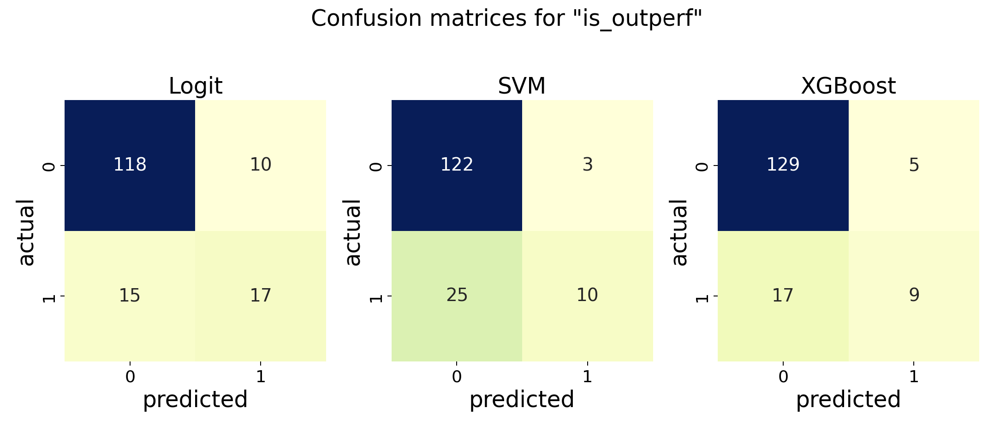
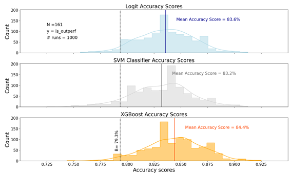
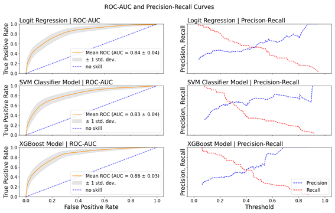

# Startup Success Prediction using Machine Learning

This repository contains my old code used in my first Master thesis for analyzing and predicting the success of startups based on the global investment dataset of a Corporate Venture Capital company. The dataset is confidential and thus not included in this repository. However, the code showcases the analysis process and predictive modeling steps that were used.

> Note: The thesis and this publish code has been created in spring of 2022 before the arrival of ChatGPT and is thus only based on my rudimentary coding skills back then.

## Upfront: What I Would Do Differently Now

Looking back at this code, there are several improvements I would implement to make the workflow more efficient and interpretable:

- **Use Jupyter Notebooks**: Break down the analysis into clearer, step-by-step sections for better readability and more granular insights.
- **Implement Cross-Validation**: Use `GridSearchCV` or `RandomizedSearchCV` instead of the random 20 shuffles to perform more rigorous hyperparameter tuning and improve model robustness.
- **Refactor Code**: Organize repeated tasks (like data splitting and model training) into reusable functions to reduce redundancy.
- **Use a Larger Dataset**: The dataset used only contained 800 entries (after cleaning). Expanding the dataset would likely improve model training and generalizability. However, this would require a larger (C)VC being open to analyze their portfolio in such a way.
- **Enhance Reporting**: Automatically generate summary reports after each model run, making it easier to track and interpret results.
- **Track Experiments**: Implement a simple logging mechanism to track model runs, parameters, and results (could use Python logging or even an external tool).

---

## Main Outcomes

### Breakdown of the Code

## Descriptive Analysis

In this section, I first performed various descriptive analyses to explore the dataset and identify key patterns in startup performance.

### Key Features:
1. **Dataset Overview:**
   - Basic statistical summaries and exploratory data analysis (EDA) on startup investments.
   - Groupings by year, region, and other factors, offering insights into investment patterns.

2. **Distribution Analysis:**
   - Visualization of **TVPI** (Total Value to Paid-In) and **IRR** (Internal Rate of Return) through histograms, cumulative distributions, and marginal gain analyses.

3. **Capital Gain and Proceeds Analysis:**
   - Analysis of capital gains and proceeds distributions, comparing overall patterns and trends before and after a given cutoff year (2018). The cutoff of 2018 was chosen to have comparison of the overall portfolio against startups that "had time" to develop until 2022.

4. **Correlation Analysis:**
   - Scatter plots visualizing correlations between startup maturity, TVPI, initial investment amount, and time-to-exit.

5. **Output:**
   - Key insights, such as the relation of IRR and TVPI, are exported to Excel files for further review.

## Predictive Modeling

This section applies 3 machine learning models (Logit, SVM and XGBoost) to predict the success of startups. The code trains models on features like region, sector, and investment amount to predict the performance of startups as measured by the binary label is_outperform, which is based on startups that outperformed the average TVPI of the overall portfolio.

### Key Steps:
1. **Feature Selection:**
   - Predictors are chosen, including variables such as sector (e.g., `is_fintech`, `is_ehealth`), investment characteristics (e.g., `total_invamt_EUR`), and regional indicators.

2. **Logistic Regression:**
   - Two logistic regression models are implemented using `StatsModels` and `Sklearn`, allowing for coefficient analysis and performance scoring.

3. **SVM Classifier:**
   - An SVM model is trained using the radial basis function (RBF) kernel. Accuracy, recall, and precision scores are calculated for model evaluation.

4. **XGBoost Model:**
   - A gradient-boosting classifier is built using `XGBoost`, leveraging hyperparameters such as learning rate, maximum depth, and regularization. The relative feature importance is then visualized to compare feature importance to the descriptive and logit analysis.

5. **Model Evaluation:**
   - The models are evaluated using **accuracy**, **recall**, and **precision** scores over multiple validation runs.
   - **ROC-AUC** and **Precision-Recall** curves are plotted for each model to compare performance.

6. **Confusion Matrices:**
   - Confusion matrices for each model (Logit, SVM, XGBoost) are displayed to further assess model prediction accuracy.

7. **Score Distribution and ROC Curves:**
   - The accuracy score distributions and ROC curves are plotted to evaluate the performance of the three models.

### Visualization:
- **Confusion Matrices** and **ROC-AUC/Precision-Recall Curves** provide a comprehensive view of each model’s performance.
- Accuracy scores for each model are displayed through histograms, with baselines marked for reference.